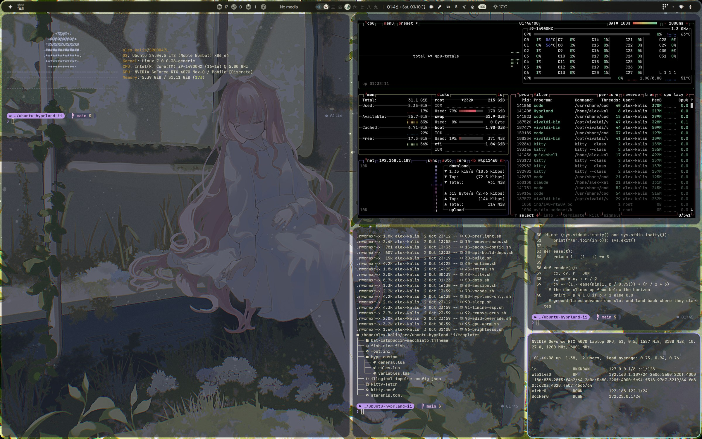

# ubuntu-hyprland-ii

Setup scripts and fixes for a **Lenovo Legion 7 16IRX9** (i9 + RTX 4070) running **Ubuntu 24.04**. Two independent parts:

1. **Laptop fixes**: Bluetooth audio, sleep and hibernate, hybrid graphics, responsiveness, lid close, a tuned Windows VM. They work on stock Ubuntu; no desktop required.
2. **Personal desktop (optional)**: Hyprland with end-4's dots, built from source into your home folder.

Tested on: DMI product `83FD`, kernel `7.0.0-38-generic`, NVIDIA driver 595 (open), Realtek RTL8852CE Wi-Fi/Bluetooth, boot through Limine. Other Legion models: see [Safety](#safety-and-rollback).

## The fixes at a glance

| Problem | What was wrong | Fix | Phase | Status | Details |
|---|---|---|---|---|---|
| Battery life and heat | RTX 4070 drew the desktop and never slept (~10 W idle) | BIOS Hybrid mode: iGPU draws the desktop, NVIDIA sleeps until an app is offloaded to it | 91, 95, 99 | 🟢 Boots and sleeps; suspend and external monitor still to test | [Hybrid graphics](docs/hybrid-graphics.md) |
| Bluetooth headphones stutter and pop | Wi-Fi scanned every 15 s; PipeWire lost realtime priority after suspend; Wi-Fi power save; old firmware | geoclue Wi-Fi off, `pipewire` group, power save off, newer firmware | 97 | 🟢 Much better. Pops remain under heavy Wi-Fi downloads | [Bluetooth audio](docs/bluetooth-audio.md) |
| Black panel or hang after suspend | S3 "deep" sleep, NVIDIA's systemd sleep services | s2idle, NVIDIA kernel suspend notifiers | 90, 91 | 🟢 Fixed | [Sleep and hibernate](docs/sleep-hibernate.md) |
| Hibernate didn't work | No resume setup, swap too small | 32 GB `/swap.img`, `resume=` on the kernel command line | 90, 91 | 🟢 Works (wake with the power button) | [Sleep and hibernate](docs/sleep-hibernate.md) |
| 640x480 or black panel after resume | Panel EDID re-read | EDID pinned with `drm.edid_firmware` | 93 | 🟢 Fixed (secondary fix) | [Sleep and hibernate](docs/sleep-hibernate.md) |
| First window or animation after idle stutters | GPU idles at its lowest clock; CPU in `power-saver` on AC | Clock floors and `performance` profile on AC only | 95 | 🟢 Fixed | [Responsiveness](docs/responsiveness.md) |
| Laptop warm and awake after lid close | s2idle never powers down fans/backlight (~6 W) | Lid on battery hibernates; on AC it only blanks the panel | 98 | 🟢 Fixed | [Lid close](docs/lid-close.md) |
| Windows VM slows the whole laptop | 8 GB swap, small unpinned VM | 32 GB swap; 20 GiB / 16 vCPU VM pinned to P-cores | 90 + VM XML | 🟢 Fixed | [Windows VM](docs/windows-vm.md) |

## Apply the fixes

```bash
git clone <this repo> ~/src/ubuntu-hyprland-ii && cd ~/src/ubuntu-hyprland-ii
./setup.sh 00      # read-only: does this machine match the tested hardware?
./setup.sh 97      # Bluetooth audio
./setup.sh 90 91   # sleep + hibernate (91 needs Limine), then reboot
./setup.sh 93      # optional: pin the panel EDID
./setup.sh 95      # optional: GPU/CPU clocks (mode-aware: Hybrid or dGPU-only)
./setup.sh 98      # optional: lid close
# Hybrid graphics: set the BIOS graphics mode to Hybrid, reboot, then:
./setup.sh 99      # NVIDIA runtime power-down; reboot again
```

Run as the normal user; the scripts call `sudo` themselves. Every phase is safe to re-run. Reboot after 97, 90/91 and 99.

The Windows VM is not a phase: `virsh define templates/libvirt-win11.xml`.

## Safety and rollback

- **Rollback:** every phase script has a rollback line in its header, and each doc page ends with one. If etckeeper is installed, `/etc` changes are committed with a "Phase NN" message.
- **Hardware check:** phases 90-99 compare DMI (`vendor|product|version`) with `HW_TESTED` in `config.env` and refuse to run on other models. On a similar Legion, read the phase, then run it with `HII_FORCE_HW=1`. For phase 97 first check `lspci -nn | grep -i network` shows `RTL8852CE [10ec:c852]`.
- **Fleet agent:** every run fingerprints the Fleet/osquery agent (`orbit`, `fleet-osquery`, `sunrise-firstboot`) before and after and exits with code 3 if anything changed. No phase touches it.
- **GRUB machines:** phase 91 writes into Limine. On stock GRUB, run only phase 90 and add `mem_sleep_default=s2idle resume=UUID=<root UUID> resume_offset=<first block of /swap.img>` to `GRUB_CMDLINE_LINUX_DEFAULT`, then `sudo update-grub`. Not tested.
- **Sleep fixes are fragile.** Test any change with an RTC wake alarm, not the lid. Details in [Sleep and hibernate](docs/sleep-hibernate.md).

## Personal desktop (optional)

Hyprland 0.56 with [end-4/dots-hyprland](https://github.com/end-4/dots-hyprland), built from source into `~/.local/opt/hyprland` as an extra login session. Phase 80 can make it the only desktop.



```bash
./setup.sh --list   # what each phase does
./setup.sh          # 00 15 20 30 40 48 50 60: backup, deps, build (30-60 min), runtime, kitty, dots, login entry
```

Optional phases: `10` remove snaps, `45` EasyEffects/ddcutil, `70` VS Code, `80` remove Plasma/GNOME (destructive), `96` brightness keys. Everything about it is in [Hyprland desktop](docs/hyprland-desktop.md): install, isolation, Ubuntu workarounds, monitors, linked workspaces, known issues.

## Documentation

| Page | Contents |
|---|---|
| [Hybrid graphics](docs/hybrid-graphics.md) | Status, what changed, offloading apps to NVIDIA, trade-offs |
| [Bluetooth audio](docs/bluetooth-audio.md) | Causes, fixes, before/after measurements, remaining pops |
| [Sleep and hibernate](docs/sleep-hibernate.md) | s2idle, NVIDIA suspend, swap and resume, Limine |
| [Responsiveness](docs/responsiveness.md) | GPU/CPU clock floors and `maintenance/power-report.sh` |
| [Lid close](docs/lid-close.md) | Hibernate on battery, blank on AC |
| [Windows VM](docs/windows-vm.md) | RAM budget, CPU pinning, Hyper-V settings |
| [Hyprland desktop](docs/hyprland-desktop.md) | Install, monitors, workspaces, known issues |
| [Maintenance](docs/maintenance.md) | Rollback, extra software, updates (`maintenance/update.sh`) |

## Repository layout

```
setup.sh          runs phases in order or by number (./setup.sh --list)
phases/           numbered scripts: 00-80 desktop, 90-99 laptop fixes
config.env        pinned versions, hardware check, protected packages
docs/             one page per topic
maintenance/      update.sh, bump.sh, power-report.sh, diff-dots.sh
templates/        kitty, fish, hypr config, libvirt VM XML
session/          login wrapper and small shims
patches/ lib/ packages/
```
